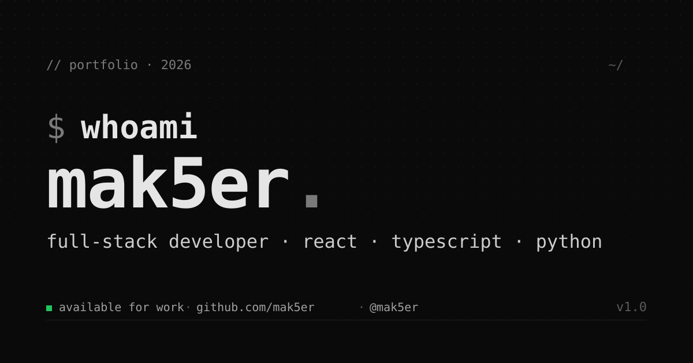

# 👨‍💻 mak5er — portfolio v2

Welcome to my personal portfolio. A sleek, terminal-flavored, minimalistic web experience built for developers.

 <!-- You can replace this with an actual screenshot later -->

## ✨ Features

- **Terminal Aesthetic:** Clean, black-and-white theme with code-style cues (`~/path`, `//`, blinking caret, `$ git log`).
- **Global Command Menu (Cmd + K):** Navigate the entire site, view socials, and run actions using a universal command palette.
- **Top-Tier Performance:** Perfect 100/100 Lighthouse scores across Performance, Accessibility, Best Practices, and SEO.
- **Progressive Web App (PWA):** Fully installable with offline support via `vite-plugin-pwa` and Workbox.
- **Micro-Animations:** Smooth scroll reveals, dynamic text typing effect in the hero, and staggered cascade animations for skills.
- **Responsive & Mobile First:** Seamlessly adapts from wide desktop monitors to mobile screens.

## 🛠 Tech Stack

- **Framework:** [React 18](https://react.dev/) + [TypeScript](https://www.typescriptlang.org/)
- **Build Tool:** [Vite 5](https://vitejs.dev/)
- **Styling:** [Tailwind CSS 3](https://tailwindcss.com/)
- **Icons:** [Lucide React](https://lucide.dev/)
- **Command Palette:** [cmdk](https://cmdk.paco.me/)
- **SEO & Head Tags:** Custom Vite SEO plugin

## 🚀 Getting Started

### Prerequisites
Make sure you have Node.js and `npm` (or `yarn` / `pnpm`) installed.

### Installation & Run

1. Clone the repository
   ```bash
   git clone https://github.com/mak5er/portfolio-v2.git
   cd portfolio-v2
   ```

2. Install dependencies
   ```bash
   npm install
   ```

3. Start the development server
   ```bash
   npm run dev
   ```

4. Build for production
   ```bash
   npm run build
   ```

5. Preview production build locally
   ```bash
   npm run preview
   ```

## 📝 Customization

All site content lives in a single localized source of truth. You don't need to dig through components to update your information.

Edit `src/data/content.ts` to modify:
- **Profile:** Handle, tagline, bio, location.
- **Contact:** Email, GitHub, Telegram, LinkedIn, Twitter links.
- **Skills:** Programming languages, frameworks, and tools.
- **Projects:** Featured repositories and web applications.
- **Experience:** Timeline of your work history.
- **Rig:** Hardware specs (PC, Homelab, Devices).

## 📄 License
This project is open-source and available under the [MIT License](LICENSE). Feel free to fork and adapt it!
